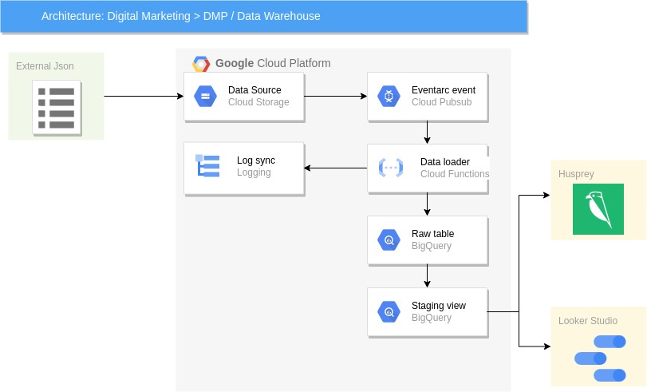

# Intro

This is the central repository of the Data team. It contains all the code and
configuration needed to run the different tasks handled by the team.

# Asumptions for the test

* We are going to use GCP as our cloud provider
* It is assumed that the transactional files will follow the same schema as the dummy data file


# How is this repository structured?

This repository contains multiple software components organized in a monorepo.

 |Directory                      | Description                                                |       
 |------------------------------ | -----------------------------------------------------------|
 |[/dags](/dags)  | Airflow dags configurations                             |
 |[/dbt](/dbt)            | The dbt  transformation models                                             |
 |[/docs](/docs)    | Documentation|
 |[/utils](projects/utils)    | Set of small developments created by the team to address specific tasks|
 |[/cloud_functions](/cloud_functions)    | stateless workers/scripts|

# Where are the docs?
* Each project have its own `readme.md` file
* A set of How To documentation organized by domain can be find in [docs/](docs/)


# Data Architecture



* The ingestion system is based in serverless architecture, everytime a file is uploaded into the cloud storage buck an event is triggered using pubsub eventarc. This allows for maximum performance and only paying the computation time needed
* This event is used as trigger for the cloud function, it will receive the name of the file and the bucked from the event and perform the following:
    * Verify that it is as .json file
    * Validate the schema, the schema validation is per entry, so a single file could have several faulty entries and the good ones will still be loaded, for the exercise we declared userId, id, Amount and RecordDate as principal keys, if any of these keys is faulty, the entry will be descarded
    * Load the data into bigquery transactions_raw table
    * Aditionally there are logs generated along the process that can potentially triger alerts or actions using cloud logging
* In Bigquery the data is loaded in a table partitioned by RecordDate, to reduce the consumption of the queries
* There is a small trasformation using a view to generate MerchantGroup (the MerchantName normalized), deduplication based on the Fingerprint column and to generate some datetime columns for easy queries.
* The data is display using Google Looker Studio for simplicity and Husprey as BI/exploratory tool

# Current State
* The platform is currently running, the data is loaded in less that 1 min, you can upload files using the rest api
```bash
curl -X POST --data-binary @{FILE_PATH} \
    -H "Content-Type: application/json" \
    "https://storage.googleapis.com/upload/storage/v1/b/{BUCKET_NAME}/o?uploadType=media&name={FILE_NAME}"
```
Example

```bash
curl -X POST --data-binary @extract_20230122.json \
    -H "Content-Type: application/json" \
    "https://storage.googleapis.com/upload/storage/v1/b/my_bucket/o?uploadType=media&name=extract_20230122.json"
```
* The BUCKET_NAME will be shared in the email
* The platform can be scaled up to 1000 operations at the same time (file loads), but for the POC I've set up for a max number of concurrent operations of 10
* There is no file size limitation although for JSON files it is recomendad to keep the size under 100-200MB
* Looker Studio is programed to refresh the data every 15 min (the minimum possible), but if required I can share an access to Husprey and you can check the data in real-time 

# How to evolve the platform

## One week
* Add dbt to execute incremental transformations, generate marts, and perform data quality testing such as deduplication
* Use Airflow or other orchestation tool to trigger dbt 
* Understand the business needs and adjust the dashboard
* Add a basic CI/CD system based on cloud build for automatic deploy
* Integrate coverage a unit tests 
* Set up a basic alert system

## One Month
* Generate a data catalog using [OpenMetadata](https://docs.open-metadata.org/).
* Implement data anomaly detection tools such as  [Montecarlodata](https://www.montecarlodata.com/).
* Improve the CI/CD, the test coverage and the alert system


## After one month
* Look for other data sources for enrichment, implement [Airbyte](https://airbyte.com/) for data sync/extraction
* Exploratory analysis for Bucketization of the user data, clustering anaysis
