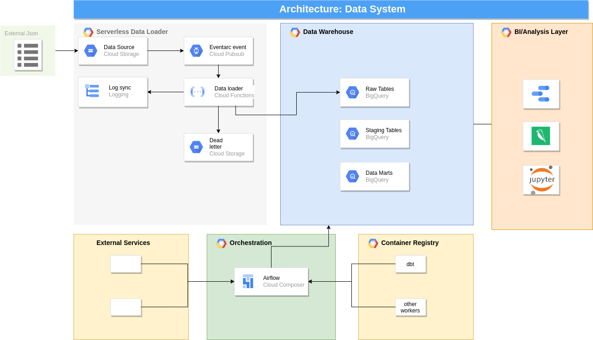

# Data Stack Extendd

This is doc will try to expain how the proposed data pipeline can be integrated with Airflow and running pipelines running on it

# Asumptions for the test

To further explain the ingestion system, we will now assume the following:
* Airflow is running using Cloud Composer
* There are pipelines ingesting data into the Data Warehouse via Dags

# Data Architecture

* The proposed ingestion system remains the same, except, a missing part in the design has been added, the dead letter, this is a Cloud Storage bucket that will serve as a sink for the entries that do not comply with the data schema, this way, the "faulty" entries can be further analyzed and reformatted, to avoid data missing
* Airflow will be the central area of orchestration, performing the following tasks:
	* Execute dbt for the data transformation, validation (using [dbt-expectations](https://github.com/calogica/dbt-expectations) package) and consolidation, this will collect all the raw tables, format the data to generate the staging tables, from the distinct staging tables we will consolidate the data in data marts, to represent business processes and entities, abstracted from the data sources that they are based on.
	* Execute the current pipelines
	* Run sync systems such as Airbyte
 	* Instanciate reverse ETLs workers
 	* Potentially triggering external services
* The container registry will host all the docker images such as dbt, generated via CI/CD. Example: When the dbt folder has changed in the main branch of the repo, a CI/CD flow will be triggered to execute the tests, invoke Cloud Build, and save the generated image in the container registry, it is preferred to use containerized applications in airflow instead of using bash or python operators  
* The Bi & Analysis layer will congregate all the tools used for analysis and presentation
 